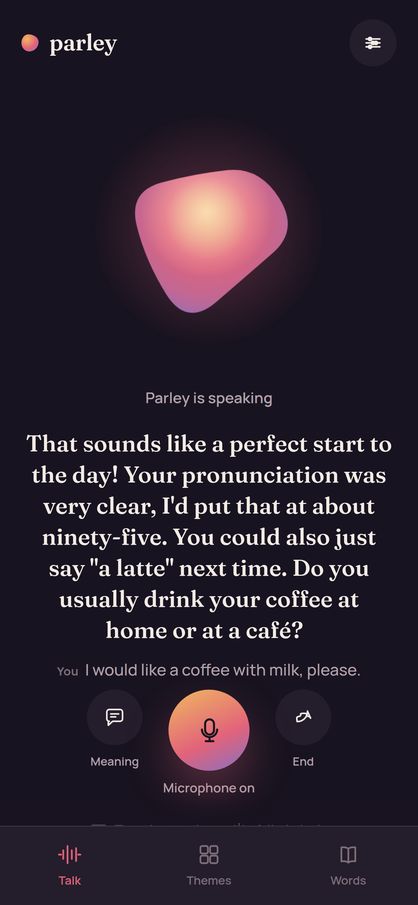

# Parley

A voice-first **English speaking tutor** you can install as a web app. You talk
to it out loud, it answers with real speech, shows the live transcript, and
gives you a short pronunciation + grammar score after every turn. Built on the
Gemini Live API.



## Run it locally

```bash
npm install            # the only dependency is `ws`
cp .env.example .env   # add your GOOGLE_API_KEY
npm start              # http://127.0.0.1:8080
```

Open that URL in a browser and tap the microphone. (Microphone access needs a
secure context — `localhost` or HTTPS. To try it on your phone, serve it over
HTTPS or use a tunnel.)

## Test it

```bash
npm test               # unit tests, no network
npm run e2e            # real round trip against the Gemini Live API
npm run browser-check  # headless Chrome driving the real page with a fake mic
```

---

More detail: [docs/DEVELOPING.md](docs/DEVELOPING.md) — environment variables,
model fallbacks, testing, and the cache/versioning rules for shipping an update.
Design system: [DESIGN.md](DESIGN.md). Want to help? [CONTRIBUTING.md](CONTRIBUTING.md).
